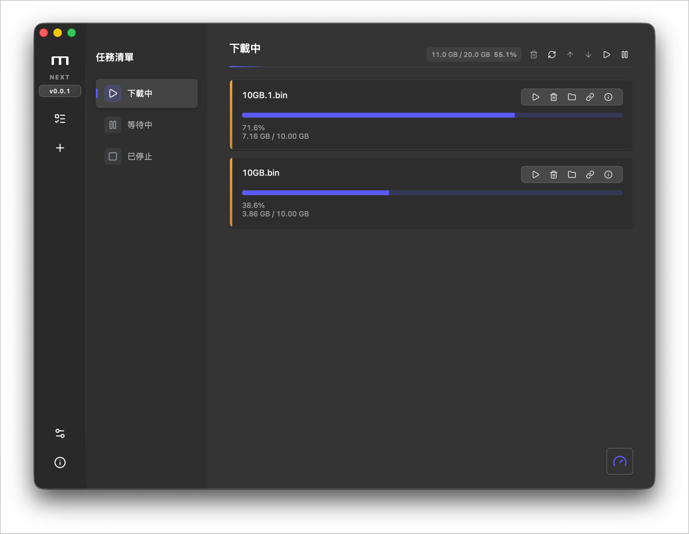
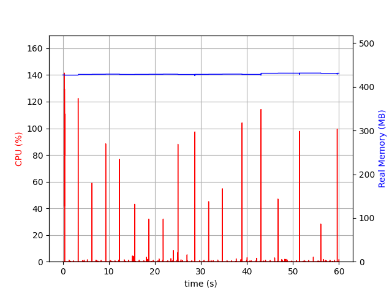
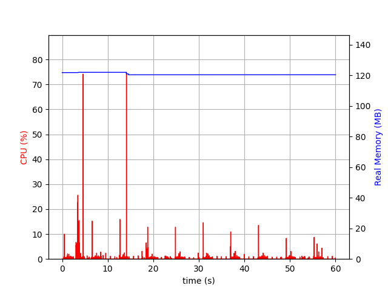
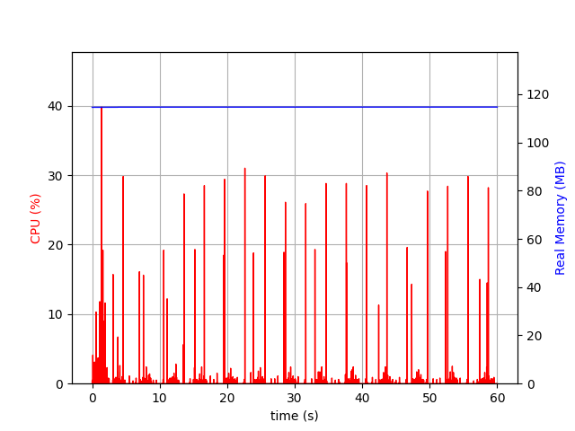
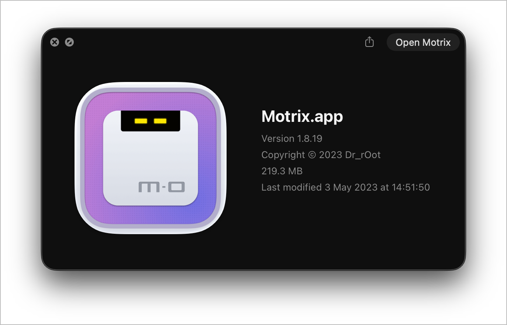
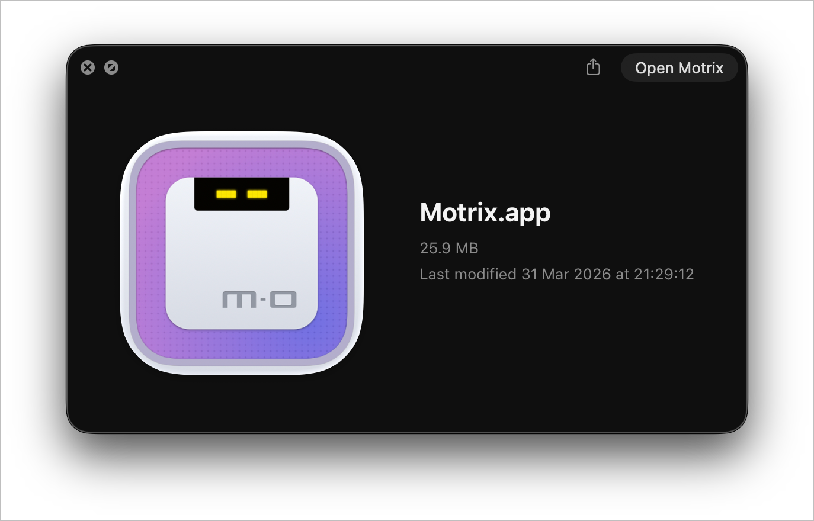
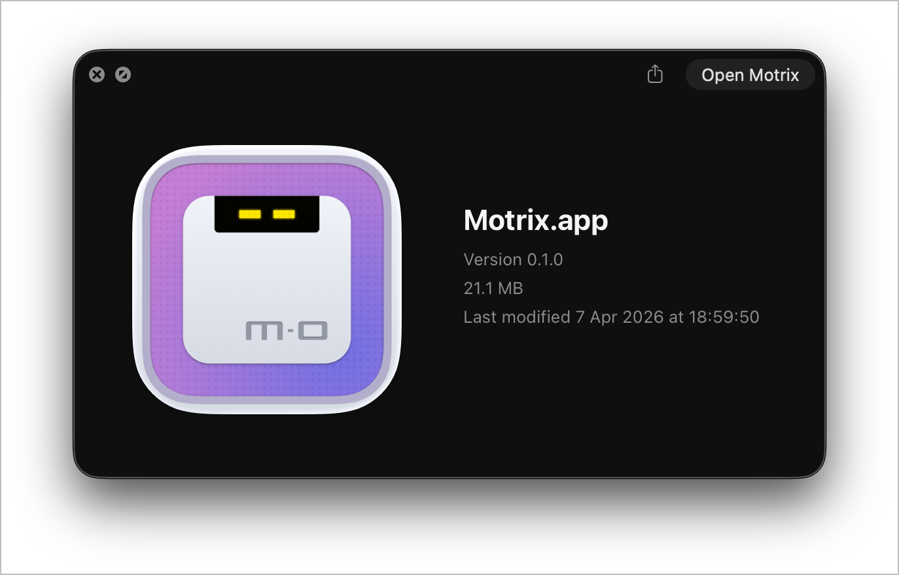

# Risuko

<p>
  <a href="https://risuko.vercel.app">
    
  </a>
</p>

## 一款全能的下载工具


[English](./README.md) | 简体中文

Risuko 是一款全能的下载工具，支持下载 HTTP、FTP、BT、磁力链等资源。它的界面简洁易用，希望大家喜欢 👻。

✈️ 去 [官网](https://risuko.vercel.app) 逛逛

## 💽 安装

### Github 下载
从 [GitHub Releases](https://github.com/YueMiyuki/Risuko/releases) 下载并安装

### NPM 包
Risuko 提供 NPM 包，包含 WebUI 和 Risuko 引擎
```
pnpm install -g @risuko/app
risuko-app --port 8080
```

或只安装CLI
```
pnpm install -g @risuko/cli
risuko-cli --help
```

## 🖥 应用界面



## ⌨️ 本地开发

### 克隆代码

```bash
git clone https://github.com/YueMiyuki/Risuko
```

### 安装依赖

需要 Node.js >= 22。

```bash
cd risuko
pnpm install
```

天朝大陆用户建议使用淘宝的 npm 源

```bash
npm config set registry 'https://registry.npmmirror.com'
```

### 开发模式

```bash
pnpm run dev
```

### 编译打包

```bash
pnpm run build
```

## 🛠 技术栈

- [Tauri v2](https://v2.tauri.app/)
- [Vue 3](https://vuejs.org/) + [Pinia](https://pinia.vuejs.org/) + [shadcn-vue](https://www.shadcn-vue.com/)
- [Vite](https://vite.dev/)
- [TypeScript](https://www.typescriptlang.org/)
- [Tailwind CSS](https://tailwindcss.com/)

## ☑️ TODO

请看Issue的roadmap


## 性能

The Next version use half the memory comparing to original, also significantly less CPU usage bursts  
In Next v0.1.0, there is performance optimization because aria2 is replaced by native Rust  
All captured while idle, with command `psrecord <PID> --plot memory.png --include-children --duration 60`  
App info provided by Finder  
v0.1.0 has a singnificantly less CPU and memory usage, and smaller bundle size comparing to v0.4.0-alpha
Comparing to original, v0.1.0 has:
  - ~90% less bundle size (219.3 MB -> 21.1 MB)
  - ~70% less memory usage (taking nearest tenth, ~400MB -> ~120MB)
  - ~70% less peak CPU usage (~140% -> ~40%)

| Orignal | Next | Next v0.1.0 |
| ------- | ---- | ----------- |
|  |  |  |
|  |  | 

This is generated with 

## 🤝 参与共建 [](http://makeapullrequest.com)

如果你有兴趣参与共同开发，欢迎 FORK 和 PR。

## 🌍 国际化

欢迎大家将 Risuko 翻译成更多的语言版本 🧐，开工之前请先阅读一下 [翻译指南](./docs/CONTRIBUTING-CN.md#-翻译指南)。

| Key   | Name                | Status                                                                                                      |
| ----- | :------------------ | :---------------------------------------------------------------------------------------------------------- |
| ar    | Arabic              | ✔️ [@hadialqattan](https://github.com/hadialqattan), [@AhmedElTabarani](https://github.com/AhmedElTabarani) |
| bg    | Българският език    | ✔️ [@null-none](https://github.com/null-none)                                                               |
| ca    | Català              | ✔️ [@marcizhu](https://github.com/marcizhu)                                                                 |
| de    | Deutsch             | ✔️ [@Schloemicher](https://github.com/Schloemicher)                                                         |
| el    | Ελληνικά            | ✔️ [@Likecinema](https://github.com/Likecinema)                                                             |
| en-US | English             | ✔️                                                                                                          |
| es    | Español             | ✔️ [@Chofito](https://github.com/Chofito)                                                                   |
| fa    | فارسی               | ✔️ [@Nima-Ra](https://github.com/Nima-Ra)                                                                   |
| fr    | Français            | ✔️ [@gpatarin](https://github.com/gpatarin)                                                                 |
| hu    | Hungarian           | ✔️ [@zalnaRs](https://github.com/zalnaRs)                                                                   |
| id    | Indonesia           | ✔️ [@aarestu](https://github.com/aarestu)                                                                   |
| it    | Italiano            | ✔️ [@blackcat-917](https://github.com/blackcat-917)                                                         |
| ja    | 日本語              | ✔️ [@hbkrkzk](https://github.com/hbkrkzk)                                                                   |
| ko    | 한국어              | ✔️ [@KOZ39](https://github.com/KOZ39)                                                                       |
| nb    | Norsk Bokmål        | ✔️ [@rubjo](https://github.com/rubjo)                                                                       |
| nl    | Nederlands          | ✔️ [@nickbouwhuis](https://github.com/nickbouwhuis)                                                         |
| pl    | Polski              | ✔️ [@KanarekLife](https://github.com/KanarekLife)                                                           |
| pt-BR | Portuguese (Brazil) | ✔️ [@andrenoberto](https://github.com/andrenoberto)                                                         |
| ro    | Română              | ✔️ [@alyn3d](https://github.com/alyn3d)                                                                     |
| ru    | Русский             | ✔️ [@bladeaweb](https://github.com/bladeaweb)                                                               |
| th    | แบบไทย              | ✔️ [@nxanywhere](https://github.com/nxanywhere)                                                             |
| tr    | Türkçe              | ✔️ [@abdullah](https://github.com/abdullah)                                                                 |
| uk    | Українська          | ✔️ [@bladeaweb](https://github.com/bladeaweb)                                                               |
| vi    | Tiếng Việt          | ✔️ [@duythanhvn](https://github.com/duythanhvn)                                                             |
| zh-CN | 简体中文            | ✔️                                                                                                          |
| zh-TW | 繁體中文            | ✔️ [@Yukaii](https://github.com/Yukaii) [@5idereal](https://github.com/5idereal)                            |

## 📜 开源许可

基于 [MIT license](https://opensource.org/licenses/MIT) 许可进行开源。

原项目来自[agalwood](https://github.com/agalwood/Motrix)  
原作者已经三年没更新了，我本人是 Motrix 重度使用者，十分感谢原作者开源项目  
无论bro现在在哪里、在做什么，我都希望他还好 :D
